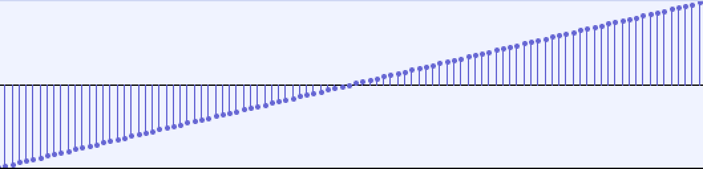

# OSC
## To run output
* Run `./app` to produce `out.raw`, a file of 32-bit signed floats
* Open Audacity, select File > Import > Raw Data...
* Navigate to out.raw and set endianness to little-endian (unless otherwise appropriate), data type to 32-bit float
